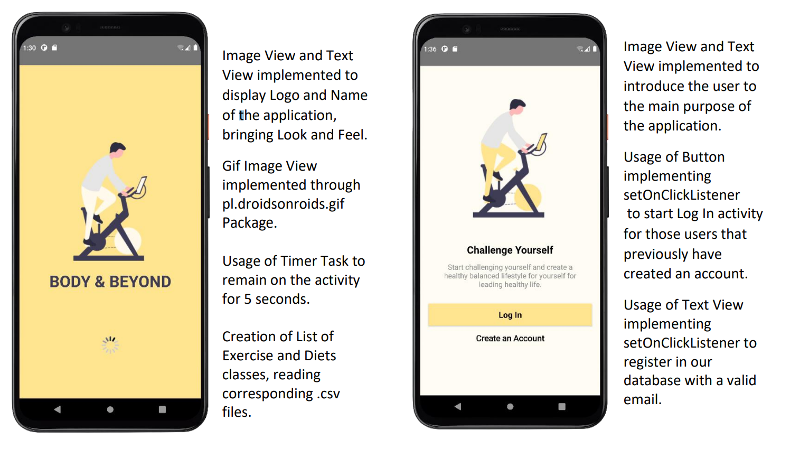
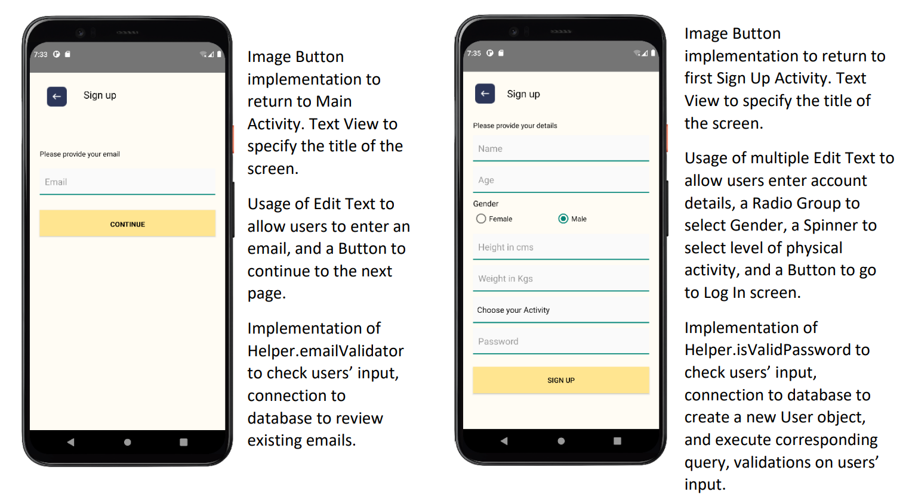
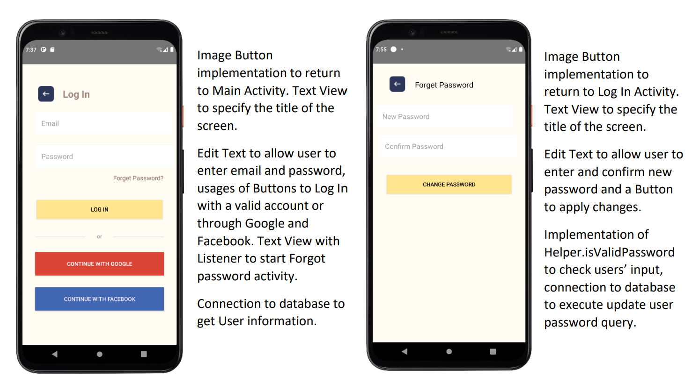
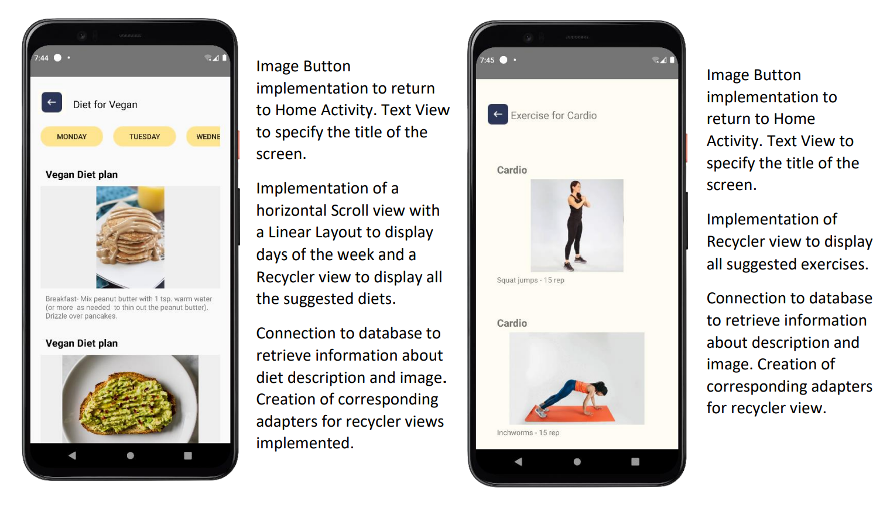
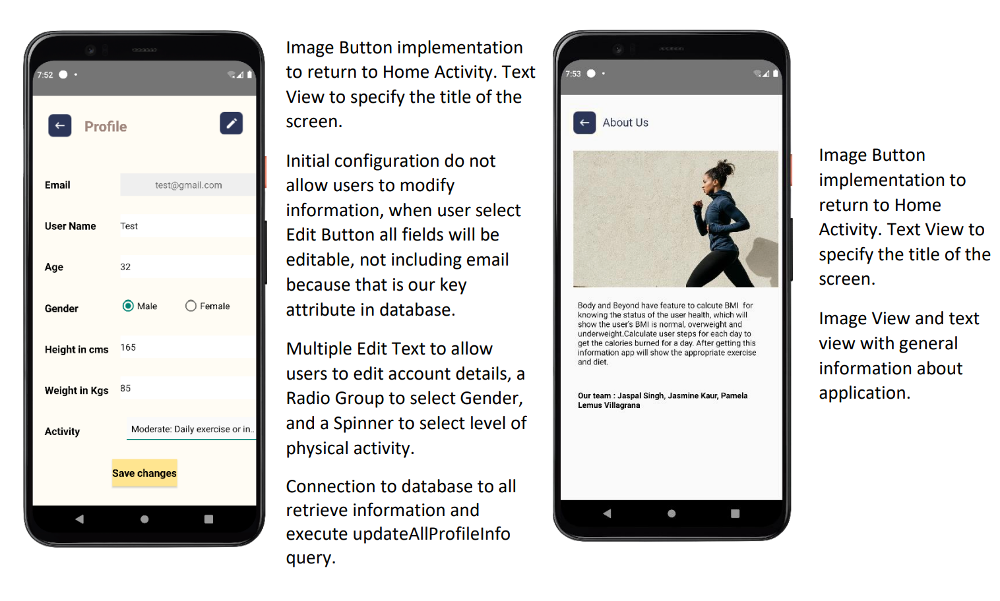
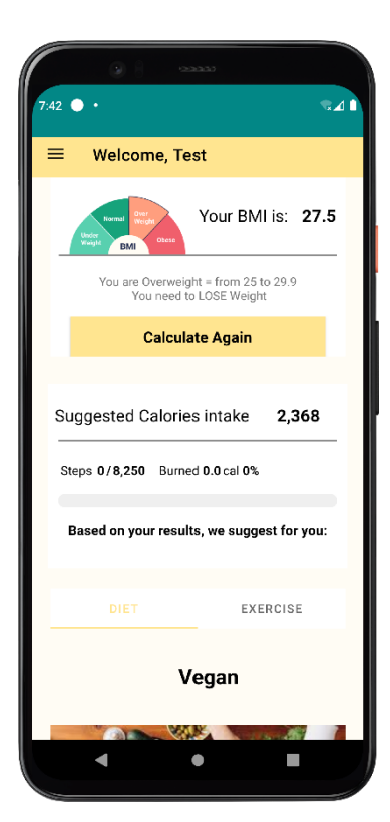

# Body & Beyond
Copyright 2022 Jaspal, Jasmine, Pamela

“Body & Beyond” is a useful application mainly because it is related to wellbeing, users have the possibility to get a 
general assessment of their health, based on simple information such as height and weight. Moreover, the application 
will make customized suggestions based on each user profile, determining the necessary measures to maintain good 
health.

## Table of Contents

- [Installation](#installation)
- [Usage](#usage)
- [Examples](#examples)

## Installation

I have create the .apk of BodyAndBeyond at location: https://1drv.ms/u/s!AvF1MnXkbmpe-w9pgH8NsWIZtRhY?e=VKBGnr
(This is generated by my system in order to show you GOOGLE and FACEBOOK login functionality)

NOTE: 
APK file is build on basis of screen 6.4 specifically S10 Plus (Samsung) you may get unmanaged UI if your screen size is bigger or smaller. 
This is the Debug version of .apk file your phone or google play store may stop you to install it. If you use this .apk GOOGLE LOGIN and FACEBOOK LOGIN will work.
If you clone the code and install the application from your system, this may create some problem related to GOOGLE LOGIN and FACEBOOK LOGIN.

This app required permission for step detection feature. After Installation of Application on you mobile phone, Please provide permission for physical activity.

In order to give the permission follow the following steps:

1.Go to the setting option of your phone.
2.Go to the apps option.
3.Search BodyAndBeyond App.
4.Click on the app and allow physical activity.
5.Go back and enjoy the feature of step count on our application

## Usage

To use Body&Beyond, follow these steps:

1. Clone the Repo.
2. Open the folder in Android Studio.
3. Run the App.
4. Install the App in android device to see features Like step counter.

## Examples

